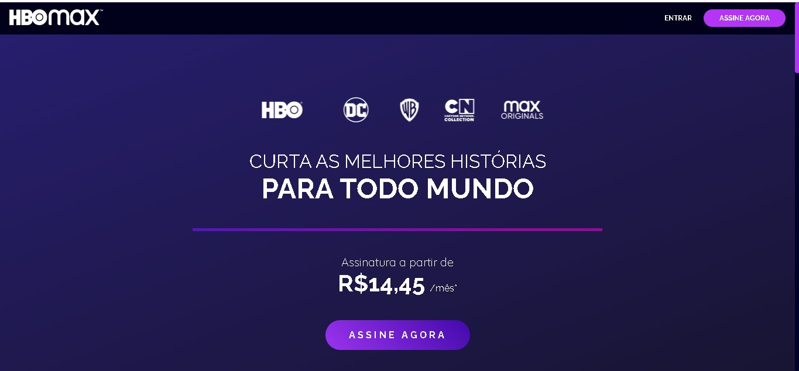

# Desafio Front-End: Clone da Landing Page HBO Max

Este projeto foi desenvolvido como um desafio de front-end, cujo objetivo era replicar a interface da landing page da HBO Max. O foco principal foi a prática de estruturação com HTML semântico, estilização avançada com SASS e a criação de um layout totalmente responsivo.

## 🚀 Deploy

Você pode visualizar o resultado final do projeto através do link abaixo:

**[Clique aqui para ver o projeto online](https://shakarpg.github.io/hbo-css/)**


## 💻 Visualização do Projeto




## ✨ Funcionalidades e Técnicas Aplicadas

-   **Estrutura Semântica:** Utilização de tags HTML5 (`<nav>`, `<header>`, `<main>`, `<section>`, `<footer>`) para um código mais limpo e acessível.
-   **Arquitetura SASS:** O CSS foi organizado de forma modular utilizando SASS, com uma estrutura de pastas para `base`, `layout` e `modules`.
    -   **Variáveis:** Cores, fontes e outras propriedades foram definidas em `_variables.sass` para fácil manutenção.
    -   **Mixins:** Media queries foram padronizadas usando mixins em `_base-mixins.sass` para controlar a responsividade.
-   **Layout Responsivo:** O design se adapta a diferentes tamanhos de tela, de dispositivos móveis a desktops, utilizando Flexbox e media queries.
-   **Efeitos Visuais Avançados:**
    -   Gradientes complexos no cabeçalho e nos botões.
    -   Efeito de *hover* nos cards do catálogo, com transições suaves de imagem e borda.
    -   Barra de navegação fixa com fundo translúcido.

## 🚀 Tecnologias Utilizadas

-   **HTML5**
-   **SASS / CSS3**
-   **Font Awesome** (para os ícones das redes sociais)

## 📂 Como Executar o Projeto Localmente

Para visualizar o projeto em sua máquina, siga os passos:

1.  **Clone o repositório:**
    ```sh
    git clone [https://github.com/SEU-USUARIO/SEU-REPOSITORIO.git](https://github.com/SEU-USUARIO/SEU-REPOSITORIO.git)
    ```
2.  **Navegue até a pasta do projeto:**
    ```sh
    cd SEU-REPOSITORIO
    ```
3.  **Abra o arquivo `index.html`** no seu navegador de preferência.

## 🧠 Objetivos do Desafio e Aprendizados

Este desafio foi uma excelente oportunidade para aprofundar os conhecimentos em:

-   Organização e arquitetura de estilos com SASS.
-   Criação de layouts complexos e responsivos com Flexbox.
-   Aplicação de transições e efeitos visuais modernos com CSS.
-   Estruturação de um projeto front-end do zero, seguindo um design de referência.

---

✨ **Créditos:** Este desafio foi inspirado e baseado no projeto desenvolvido por **Daniel de Moura**.
